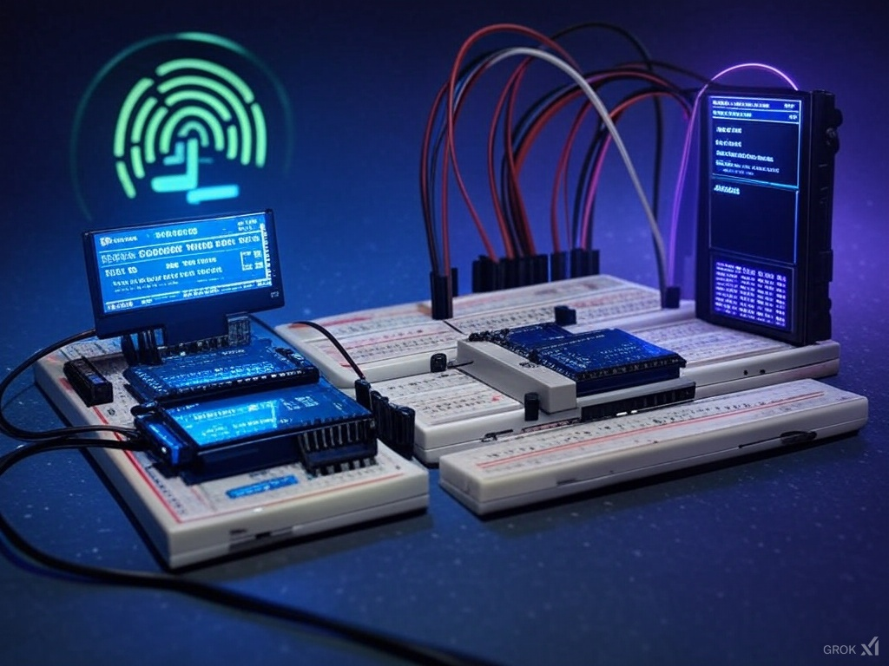

## LoRa Challenge 2025

### CTF Hardware Challenge
Welcome to the CTF Hardware Challenge Repository! This open-source project is designed to test your skills in hardware assembly, microcontroller programming, and wireless communication. Using an Arduino Nano ESP32, a Reyax RYLR998 LoRa module, an OLED display, and basic breadboard and jumper wires, you'll engage with a client-server setup to uncover hidden "flags."

### Hardware Setup
The challenge involves two main devices:

Client Device: An Arduino Nano ESP32 (IoT - 3.3v) connected to a Reyax RYLR998 LoRa module and a small OLED display (128x32 pixels).
Server Device: Similarly equipped with an Arduino Nano ESP32 and a Reyax RYLR998 LoRa module.
Both devices are assembled on breadboards using jumper wires. Correct wiring is essential for the devices to function properly. Refer to the code for specific pin configurations.

### Challenge Description
The challenge consists of three tasks, each revealing a "flag" on the client display when completed successfully:

**Initial Setup**: Correctly wire and power the client device. Upon success, the OLED display will show the first flag.

**Network Configuration**: The server continuously broadcasts the second flag over a LoRa network. Adjust the client's network settings to receive and display this flag.

**Message Transmission**: Discover and implement a method to send a specific message from the client to the server. This will trigger the server to send the third flag back to the client.
Each task requires a combination of hardware manipulation, understanding of the provided code, and creative problem-solving. Note that the code includes functionality for a button press to trigger the message sending, but no physical button is provided. Participants must find an alternative way to activate this functionality.

### Code and Resources
#### The repository contains the following files:

- `client.ino`: Code for the client device. 
- `server.ino`: Code for the server device. 

#### The code utilizes the following libraries: 
- `HardwareSerial` 
- `Wire` 
- `Adafruit_GFX` 
- `Adafruit_SSD1306` 
- `AESLib` (for encryption/decryption of flags) 

Participants are encouraged to study and modify the code to understand how the devices communicate and how the flags are handled. However, specific details about the flags, the required message, or workarounds for the missing button are intentionally omitted to preserve the challenge's integrity.

### Notes and Disclaimers
This project is intended for educational and competitive purposes.
Ensure proper safety measures when working with hardware and wireless devices.
Adhere to local regulations regarding wireless communication frequencies and power levels.
The challenge is designed to be solved through exploration, experimentation, and collaboration. Avoid seeking direct solutions or spoilers to maintain the spirit of the competition.

YouTube video references:  
- Webinar for this project:  https://youtu.be/HX649_oek0A 
- Chirp Spread Spectrum: https://youtu.be/dxYY097QNs0?si=GEv47-8djiJaNwlT

